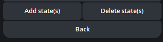

# InlineKeyboard

The `InlineKeyboard` class is used to create inline keyboards.

This document pertains to specifically to classes, `InlineKeyboardMarkup` and `InlineKeyboardButton`.

## InlineKeyboardButton

To create an inline keyboard button, simply

```py
InlineKeyboardButton(text, callback_data=None, url=None, switch_inline_query=None, switch_inline_query_current_chat=None, callback_game=None, pay=False)
```

You must provide the `text` parameter, and one of the following parameters:

- `callback_data` - Data to be sent in a callback query to the bot when button is pressed
- `url` - HTTP url to be opened when button is pressed
- `switch_inline_query` - If set, pressing the button will prompt the user to select one of their chats, open that chat and insert the bot's username and the specified inline query in the input field. Can be empty, in which case just the bot's username will be inserted.
- `switch_inline_query_current_chat` - If set, pressing the button will insert the bot's username and the specified inline query in the current chat's input field. Can be empty, in which case only the bot's username will be inserted.
- `callback_game` - Description of the game that will be launched when the user presses the button.
- `pay` - Specify True, to send a Pay button.

## InlineKeyboardMarkup

To create a markup keyboard, you need to make an 2D grid of `InlineKeyboardButton` objects.

Imagine you want to create a keyboard like this:



You would make a 2D array of `InlineKeyboardButton` objects, like this:

```py
keyboard = [
    [
        InlineKeyboardButton("Add state(s)", callback_data='1'),
        InlineKeyboardButton("Delete state(s)", callback_data='2'),
    ],
    [
        InlineKeyboardButton("Back", callback_data='3'),
    ]
]

reply_markup = InlineKeyboardMarkup(keyboard)
```

In the above example, the `keyboard` has 2 rows, where the first row contains 2
buttons, and the second row containing only 1 button.
